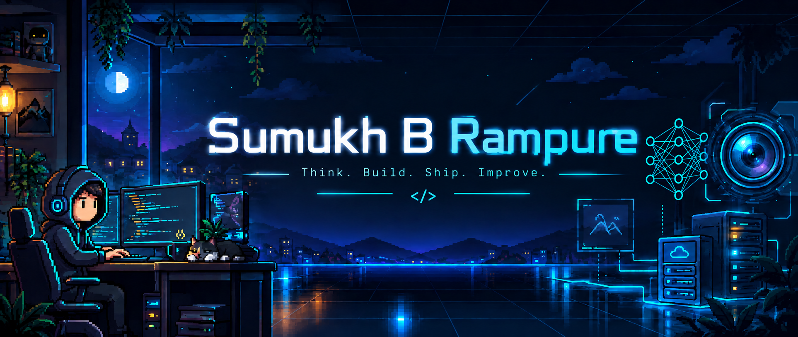

  

---

## 👋 About Me

I'm **Sumukh B Rampure**, a Computer Science Engineering student passionate about building practical software solutions.

My interests include **backend development, artificial intelligence, computer vision, APIs, databases, and software engineering**.

I enjoy learning by building projects, solving problems, and exploring technologies that can be applied to real-world use cases.

---

## 🛠️ Tech Stack

### Programming Languages

### Web Development

### Backend

### Databases

### AI & Computer Vision

### Tools

---

## 🚀 Featured Projects

### 🎮 FrameSense
**AI-Powered FPS Game Performance Analyzer**

- Analyzes FPS gameplay using **YOLOv8 and OpenCV**.
- Extracts gameplay and performance metrics.
- Built a **FastAPI backend** with a web-based dashboard.
- Secured **3rd Place** at the Mini Project Expo 2026.

**Tech:** Python · YOLOv8 · OpenCV · FastAPI · HTML · CSS · JavaScript

---

### 🎮 Mystic Arcade
**Gaming Café Management System**

- Manages customer bookings and gaming stations.
- Handles gaming sessions and billing.
- Uses a database-driven backend for managing café operations.
- Built with a focus on practical backend and database development.

**Tech:** Python · FastAPI · MySQL · HTML · CSS

---

### 🦷 OralGuard
**AI-Based Oral Health Detection System**

Currently under development.

- Uses computer vision to analyze oral images.
- Designed around object detection using YOLO.
- Focused on handling images captured from different angles and orientations.
- Aims to assist with early identification of visible oral conditions.

**Tech:** Python · YOLO · OpenCV · Computer Vision

## 📚 Currently Learning

- Data Structures & Algorithms
- Backend Development
- REST API Development
- Database Design
- Software Engineering Practices
- Machine Learning Fundamentals
- Computer Vision

---

## 💡 What I Bring

- Problem Solving
- Quick Learning
- Team Collaboration
- Leadership
- Critical Thinking
- Adaptability
- Curiosity

---

## 📊 GitHub

  
  

---

## 🌐 Connect With Me

  
  

---

  <i>Always learning. Always building.</i>

